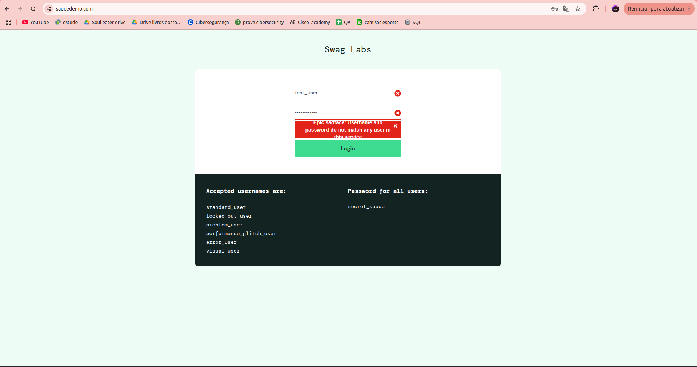

# TC 2 - [Login Usuário Inválido]

## 📋 Informações do Teste

| Campo | Descrição |
|-------|-----------|
| **ID** | TC 2 |
| **Título** | Verificar o login com um usuário inválido |
| **Módulo** | Login |
| **Prioridade** | 🔴 Alta |
| **Tipo** | Funcional  |
| **Autor** | Pedro Evaristo |
| **Data de Criação** | 10/01/2026 |

---

## 🎯 Objetivo

Validar que não será possível realizar o login com um usuário inválido utilizando a senha padrão.

---

## ⚙️ Pré-condições

-Acessar o Chrome
- Acessar a URL: https://www.saucedemo.com/
- Utilizar credenciais que não estejam na página inicial.

---

## 📝 Passos para Execução

| # | Ação | Resultado Esperado |
|---|------|-------------------|
| 1 | Acessar a URL : https://www.saucedemo.com/ | A página de login é exibida com os campos de username, senha e todas as credenciais que podem ser utilizadas|
| 2 | Preencher o campo de usuário com "test_user" ou um nome de usuário diferente dos que estão descritos na página inicial| O texto é preenchido sem erros |
| 3 | Preencher o campo de senha com "secret_sauce" | A senha é preenchida sem erros e seu conteúdo não pode ser visível |
| 4 | Clicar no botão de Login | O sistema processa a requisição |
| 5 | Aguardar a mensagem de erro| Uma mensagem sobre o usuário e senha não darem match com nenhum usuário do sistema aparece na tela.
---

## ✅ Resultado Esperado

Após clicar no botão de login o sistema deve : 
1. Validar se as credenciais são válidas
2. Exibir a mensagem de que o usuário e senha não existem

---

## 📊 Resultado Obtido

**Status:** ✅ APROVADO

**Descrição:** A mensagem de erro apareceu na tela após o sistema verificar que o usuário não existe.

---

## 📸 Evidências

---

## 🐛 Bugs Relacionados

- Nenhum bug encontrado nesse teste.

---

## 📌 Observações

- O sistema verificou que a tentativa de login foi de um usuário que não existe.
- Não foi possível acessar a página de produtos.
- Uma mensagem de erro apareceu na tela.

---

## 🔄 Histórico de Execuções

| Data | Executor | Status | Observações |
|------|----------|--------|-------------|
| 10/01/2026| Pedro Evaristo | ✅ APROVADO| Primeira tentativa- sucesso |
| 11/01/2026 | Pedro Evaristo| ✅ APROVADO| Segunda tentativa - sucesso |