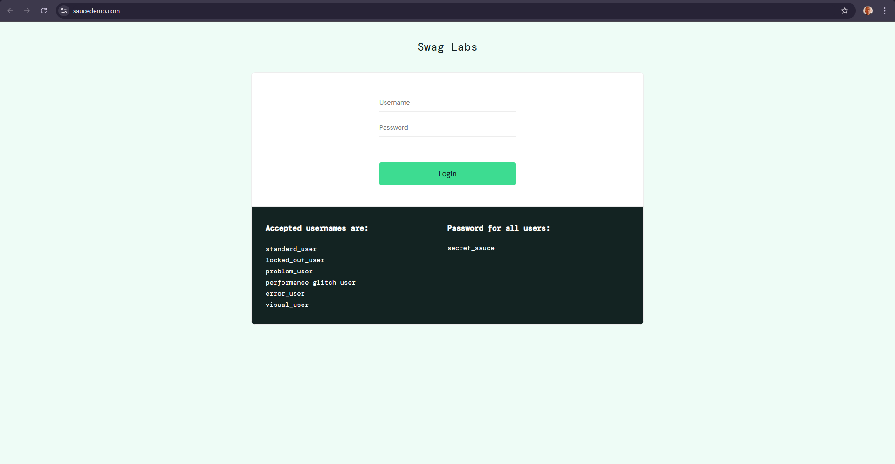
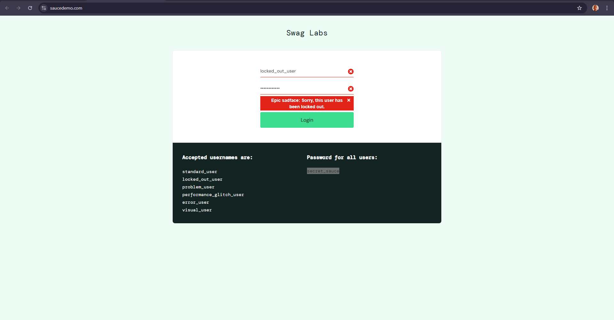

# TC 3 - [Login usuário bloqueado]

## 📋 Informações do Teste

| Campo | Descrição |
|-------|-----------|
| **ID** | TC 3 |
| **Título** | [Verificar o login com usuário bloqueado] |
| **Módulo** | [Login] |
| **Prioridade** | 🔴 Alta |
| **Tipo** | Funcional |
| **Autor** | Pedro Evaristo |
| **Data de Criação** | 14/01/2026 |

---

## 🎯 Objetivo

Verificar o comportamento do site no caso do usuário ter sido bloqueado.

---

## ⚙️ Pré-condições

- Acessar o Chrome
- Acessar a URL https://www.saucedemo.com/
- Utilizar as credenciais : Login -> locked_out_user, Senha -> secret_sauce 

---

## 📝 Passos para Execução

| # | Ação | Resultado Esperado |
|---|------|-------------------|
| 1 | Acessar a URL : https://www.saucedemo.com/ | A página de login é exibida com os campos de username, senha e todas as credenciais que podem ser utilizadas|
| 2 | Preencher o campo de username com "locked_out_user"| O texto é preenchido sem erros |
| 3 | Preencher o campo de password com "secret-sauce" | A senha é preenchida sem erros e seu conteúdo não pode ser visível |
| 4 | Clicar no botão de Login | O sistema processa a requisição |
| 5 | Aguardar a mensagem de usuário bloqueado| Uma mensagem sobre o bloqueio de usuário aparece na tela.

---

## ✅ Resultado Esperado

Após clicar no botão de login o sistema deve : 
1. Validar se as credenciais são válidas.
2. Exibir a mensagem de que o usuário foi bloqueado.
---

## 📊 Resultado Obtido

**Status:** ✅ Aprovado

**Descrição:** A mensagem apareceu na tela quando sistema percebeu que tentiva de login foi feita por um usuário bloqueado 

---

## 📸 Evidências

---

## 🐛 Bugs Relacionados

- Nenhum bug foi encontrado.

---

## 📌 Observações

- O sistema verificou que a tentativa de login foi feito por um usuário bloqueado.
- Não foi possível realizar o login.
- Uma mensagem sobre o bloqueio apareceu na tela

---

## 🔄 Histórico de Execuções

| Data | Executor | Status | Observações |
|------|----------|--------|-------------|
| 14/01/2026 | Pedro Evaristo| ✅ Aprovado | Primeira tentiva - sucesso |
| 14/01/2026 | Pedro Evaristo| ✅ Aprovado | Segunda tentiva - sucesso |